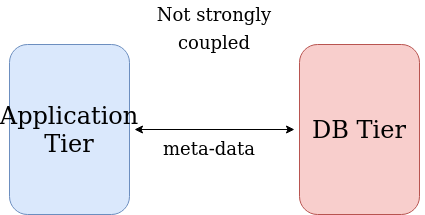
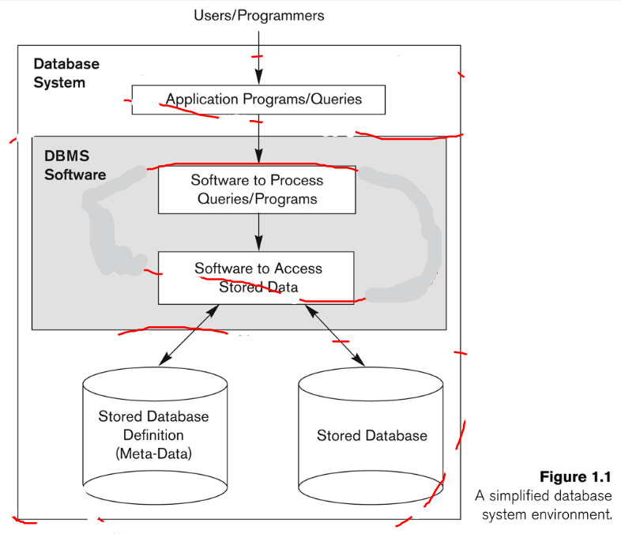

The DBMS tutorials are based on the course <i>LE/EECS3421: Introduction to Database Systems</i> offered at York University. The course was conducted in the 2022-2023 fall semester by Dr. Habib-ur Rehman.

## Database
Database is a collection of data. It does not depend on the format of the data sets, where it is stored and the size of the data sets.
It can be a single file or multiple files.
For example, a csv file containing data is also a database.

A database has four main functions as follows:

1. Defining DB  
  The data needs to be structured in the DB to be stored organizely.
  The data structure includes defining data types, relationships, constraints and so on. The data structure information is stored in DB as a DB catalog or a dictionary as well as the actual values of the data.

2. Constructing DB  
  After defining DB, the data is ready to be inserted. We can construct a DB by storing data items according to the data structure.

3. Manipulating DB  
  Manipulating means querying and updating data. 

4. Sharing DB  
  Sharing DB allows multiple users to access the DB.

## Database Management System
What happens if the data in the database needs to be created, updated, deleted or read frequently? It would be good to have a system to manage the collections of data.
DBMS stands for Database Management Systems. The system is developed to manage the database efficiently. The DBMS software serves the interface for the functions.
For example, Peoplesoft and SAP are DBMS used for HR applications. As applications handle sophisticated tasks and store a big amount of secured data such as bank transactions, the developers separate the tiers of the applications based on its functionality and purpose. Let's first take a look at the Two Tier Application Architecture.

  

The application tier is concerned with the user interface and the business logic (functionality). The DB tier takes care of the data. You can develop your own software for DBMS or buy it. The two components do not strongly depend on each other. Therefore, you have more options to choose software to manage your database as needed. However, the programming language for both tiers should be the same for the integration. 

 
The application tier receives data from the users and tosses it to the DB tier. Let's say we have a log-in application. The inputs we expect from the users are a username, a password and a security answer. These inputs are specific to the log-in application. If we have a student course enrollement application, the inputs would be different. The required data are different in cases and this is called mini-world.
The inputs of the log-in application are stored in DB in a structured manner.

  
  courtesy: R. Elmasri and S. B. Navathe

Each data has a type. For instane, the username is a string and the password is an integer. The information about the types of the meta-data, where to store, and how to handle, etc are stored in the stored database (Fig.1.1).

## Beneficial Features of Using DBMS 
To be a good DBMS, there are certain features that the DBMS needs to fulfill.
1. Self-describing nature of a DB system
2. Insulation between programs and data, data abstraction
3. Support of multiple views of data
4. Sharing of data and multiuser transaction processing

##### Self-describing nature of a DB system
In order for the data to be stored in an organized manner, the DB needs to know the data types, structures and constraints.
This is called meta-data. A meta-data is stored in a DB catalog and it describes a DB system.

##### Insulation between programs and data, data abstraction
<b> Program-data-independence: </b>  
If the structure of data changed, the application does not need to be changed. We only need to change the meta-data stored in DB catalog.
DBMS is not strongly coupled with the application tier. This means the application does not know the details of data. This is called data abstraction.
 

<b> Program-operation-independence: </b>  
The implementation of the DBMS operations (or functions) are black box. We do not know how and where the DBMS software stores the data items nor how it queries them. We only need to call it from the interface. 

##### Support of multiple views of data
Some users might have more access to the data than the others. For example, a student only can view the courses that the student is currently enrolled.
However, a course administrator can view the entire course list and enrolled students.
Depends on the user roles, the views are limited. Therefore, DBMS should be able to support multiple views of data.

##### Sharing of data and multiuser transaction processing
Transaction refers to reading or updating data. If multiple users try to access a data item and change its value at the same time, the DB needs to track all the changes and update the value correctly. In order to do this, DBMS supports a concurrency control. It is important for a DB to maintain its consistency.

## Data Model
Let's talk more details about the independence between the application tier and the DBMS tier.
The application tier does not need to know about the physical details of data. For example, where the data is stored, the size of data, etc are not the scope of the application tier. Rather, the application wants the actual values for the end users. A concept of Data model is proposed for the abstraction.
Data model hides storage and implementation details and provides conceptual representation of data.
Let's suppose that we have a student and want to store the student information in DB.

| name | id | class | major |
|------|----|-------|-------|
| Mark | 17 |   1   |   CS  |

The above table shows the conceptual representation of the data.
A relational data model uses SQL language and a non-relational data model uses No-SQL. In this tutorial, we will focus on the relational data model. For that, we will use MySQL which is a software system for relational DBMS. We need to download MySQL community server and a workbench.
To download, please click this [link](https://dev.mysql.com/downloads/).

<!-- The meta-data is stored in a structured manner. But how do we structure the data?
There are a couple of ways to do this. 
## Challenge
When we handle data using DBMS software, there is a challenge we need to consider.
What if multiple users try to change the data? Suppose a scenario where a student uploads a file and a teacher deletes the submission immediately. How does the DBMS handle the situation? Also, what if we want to display different user interfaces to users with different roles? One thing to keep in mind is that DB should remain consistent. We will discuss how to develop such DBMS that is consistent and secured through out the posts.  -->

